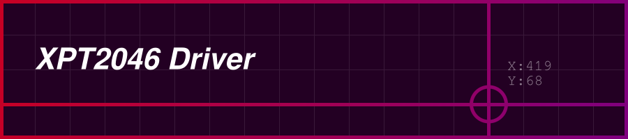

# XPT2046 Driver

<p align="center"><br></p>

An Arduino library for driving an XPT2046 touch controller. It can be used to get the X and Y position of a touch event either as a raw 12-Bit value between 0 and 4095 or as a value mapped to a display's pixel grid using a calibration matrix generated by performing a 3 point calibration.

## 🛠️ Library Functionality

These are the functions this library provides. For more detailed examples on how to use these functions, look at the [Examples](#-examples) section.

<br>

Create an XPT2046 object.
```c++
XPT2046 touch(TOUCH_CS_PIN, TOUCH_IRQ_PIN);
```
<br>

Initialize the object.
```c++
touch.begin();
```
<br>

Set the number of samples to average over before returning the touch position (optional, default = 20, range = 1-255). A higher number of samples will result in a more consistent touch position but, as a consequence, will take a longer time to process.
```c++
touch.setSampleCount(20);
```
<br>

Set the touchscreen rotation (optional, default = 0, values = 0, 1, 2, 3, 0 = 0°, 1 = 90°, 2 = 180°, 3 = 270°).
```c++
touch.setRotation(0);
```
<br>

Set the display calibration (optional, default = unset). This will map the touch position to the display's pixel grid, i.e., touchX = pixelX and touchY = pixelY. To get the calibration matrix, use the sketch: `examples/3PointCalibration/3PointCalibration.ino`.
```c++
touch.setCalibration({/*A*/, /*B*/, /*C*/, /*D*/, /*E*/, /*F*/, /*W*/, /*H*/});
```
<br>

Set the debounce timeout (optional, default = 10, time = milliseconds). This can help mitigate erroneous double touch events when touching or lifting from the touch area. Keep in mind that this is a TIMEOUT meaning if set to 1000 ms only after waiting for 1 second another touch event is registered. For something like a touch paint program, this value should be as low as possible, or even set to 0.
```c++
touch.setDebounceTimeout(10);
```
<br>

Returns if the touch area is being touched (true / false).
```c++
touch.touched();
```
<br>

Returns if a touch event has been released, i.e., a pen or finger was lifted from the touch area. Can be used in combination with touch.touched() to check for singe button presses.
```c++
touch.released();
```
<br>

Returns the X and Y position of a touch event of type `XPT2046::Point`. If calibration is not set, this will be a 12-Bit integer between `0` and `4095`. If calibration is set, this will be a pixel position on the display.
```c++
touch.getTouchPosition();
```

## ✨ Examples

### Basic Usage

The most basic example of this library can be found in the `examples/BasicUsage/BasicUsage.ino` sketch file. It initializes everything and then checks if a touch event occurred. If a touch event is captured, the touch position is printed to the Serial console. The X and Y positions are a 12-Bit integer between 0 and 4095.

### Touchscreen Usage

The `examples/TouchscreenUsage/TouchscreenUsage.ino` is an example of how to use the XPT2046 Driver library with a touchscreen. The touchscreen used in this case is an ILI9341 TFT display driven by the Adafruit GFX & ILI9341 library. It maps the touch X and Y position to the pixel grid of the ILI9341 TFT using a calibration matrix. The sketch initializes the touchscreen and display and then checks if a touch event occurred. It takes the touch position mapped to the pixel grid of the display and draws a crosshair at that point.

### 3 Point Calibration

The `examples/3PointCalibration/3PointCalibration.ino` sketch performs a 3 point calibration on a touchscreen that an XPT2046 controller. The touchscreen used in this case is an ILI9341 TFT display driven by the Adafruit GFX & ILI9341 library. The resulting calibration matrix can then be used in other sketches to calibrate and map the touch positions to the display's pixel grid.

### Example Sketch

This is a basic example showing of all functions of this library. For more detailed explanations, look at the included examples in `examples`.

```c++
// Include the library
#include "XPT2046.h"

// Create the XPT2046 touch object using CS_PIN 2 and IRQ_PIN 3
XPT2046 touch(2, 3);

void setup() {
  
  Serial.begin(115200);         // Initialize serial communication
   
  touch.begin();                // Initialize
  touch.setSampleCount(20);     // Set the sample count
  touch.setRotation(0);         // Set the rotation
  touch.setDebounceTimeout(10); // Set the debounce timeout
  touch.setCalibration({0.0654288,0.0000242,-12.5270405,-0.0008066,0.0913295,-17.0230808,240,320}); // Set the calibration matrix

}

void loop() {

  // Check if touch event is occurring and if the last event has been released
  if (touch.touched() && touch.released()) {

    // Get the touch position
    XPT2046::Point position = touch.getTouchPosition();

    // Print the position to the serial console
    Serial.println("X: " + String(position.x) + ", Y: " + String(position.y));

  }

}
```